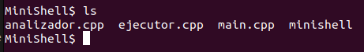
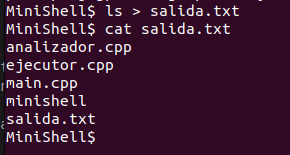
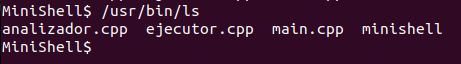
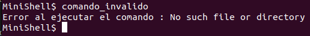
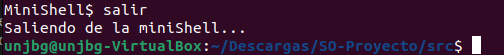

# SO-Proyecto - MiniShell en C++ sobre Linux

## Descripción
Este proyecto es una implementación de un intérprete de comandos tipo mini-shell desarrollado en C++ para sistemas Linux. MiniShell permite ejecutar comandos del sistema, soporta procesos hijo con fork/exec, redirección de salida, el manejo de errores y finaliza con el comando 'salir'.

## Requerimientos
Antes de comenzar, debes tener lo siguiente:
- Sistema operativo Linux
- Compilador g++ compatible con C++ 11 o superior

## Instrucciones de compilación
1. **Clonar el repositorio**
    'git clone <url-del-repo>'
    'cd SO-Proyecto'
2. **Compilar el proyecto**
    'g++ -o minishell main.cpp analizador.cpp ejecutor.cpp'
3. **Ejecutar el proyecto**
    './minishell'

## Características implementadas

**Funcionalidad base**
Las caracteristicas base que debe cumplir la miniSHell son las siguientes:
- Mostrar un prompt personalizado (MiniShell$).
- La resolución de rutas absolutas y relativas.(/usr/bin/ls o ls)
- La ejecución de comandos mediante procesos desde el proceso hijo(fork y exec)
- La espera del proceso padre, para que finalice el proceso hijo antres de aceptar el siguiente comando (waitpid).
- El manejo de errores con mensajes específicos (perror).
- La redirección de salida estándar (>).
- El comando 'salir' para terminar el MiniShell.

**Extensiones implementadas**
- Pipes simples (cmd1 | cmd2).
- Ejecución de tareas en segundo plano (&) no bloqueante para el prompt y muestra waitpid no bloqueante.

## Casos de prueba y ejemplos de uso
Para los casos prueba se consideraron los siguientes:
- 'ls', que muestra el listado de los archivos en directorio actual.

- 'ls > salida.txt', debe redirigir la salida al archivo salida.txt sin mostrar en pantalla.

- '/bin/ls', debe ejecutar el comando usando ruta absoluta.

- Comando inexistente muestra mensaje de error: "Error al ejecutar el comando: No such file or directory".

- Comando salir termina la shell.
